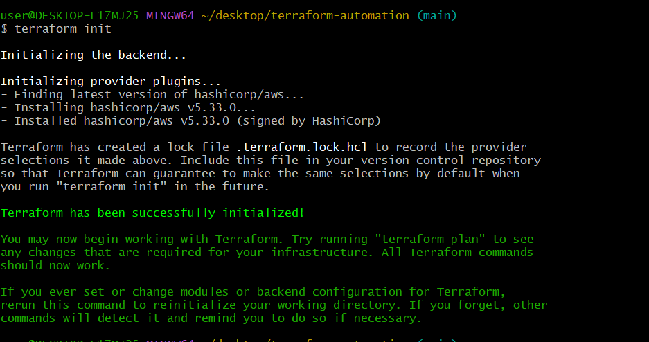

## What Is Terraform? 

Terraform is an IAC tool, used primarily by DevOps teams to automate various infrastructure tasks. The provisioning of cloud resources, for instance, is one of the main use cases of Terraform.

Terraform allows you to describe your complete infrastructure in the form of code. Even if your servers come from different providers such as AWS or Azure, Terraform helps you build and manage these resources in parallel across providers. Think of Terraform as connective tissue and common language that you can utilize to manage your entire IT stack.
##

## Prerequisites before writing Terraform code

1. Create an IAM user, name it terraform (ensure that the user has only programatic access to your AWS account) and grant this user AdministratorAccess permissions.

2. Copy the secret access key and access key ID. Save them in a notepad temporarily.

3. Configure programmatic access from your workstation to connect to AWS using the access keys copied above and a Python SDK (boto3). You must have Python 3.6 or higher on your workstation.

```
pip install boto3
pip install boto3[ctr]
```

If you have the AWS CLI installed, then you can use the aws configure command to configure your credentials file:
```
aws configure
```


Alternatively, you can create the credentials file yourself. By default, its location is ~/.aws/credentials. At a minimum, the credentials file should specify the access key and secret access key. In this example, the key and secret key for the account are specified in the default profile:

```
aws_access_key_id = YOUR_ACCESS_KEY
aws_secret_access_key = YOUR_SECRET_KEY

```
 You may also want to add a default region to the AWS configuration file, which is located by default at ~/.aws/config:

```
region=us-east-1
```

Alternatively, you can pass a region_name when creating clients and resources.

## CREATING VPC AND SUBNETS





