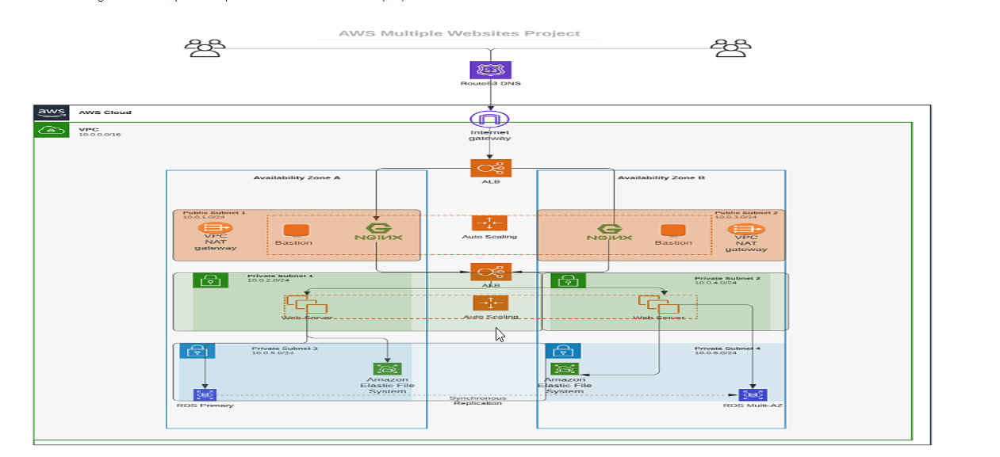


## What Is Terraform? 

Terraform is an IAC tool, used primarily by DevOps teams to automate various infrastructure tasks. The provisioning of cloud resources, for instance, is one of the main use cases of Terraform.

Terraform allows you to describe your complete infrastructure in the form of code. Even if your servers come from different providers such as AWS or Azure, Terraform helps you build and manage these resources in parallel across providers. Think of Terraform as connective tissue and common language that you can utilize to manage your entire IT stack.

## Prerequisites before writing Terraform code

1. Create an IAM user, name it terraform (ensure that the user has only programatic access to your AWS account) and grant this user AdministratorAccess permissions.

2. Copy the secret access key and access key ID. Save them in a notepad temporarily.

3. Configure programmatic access from your workstation to connect to AWS using the access keys copied above and a Python SDK (boto3). You must have Python 3.6 or higher on your workstation.

```
pip install boto3
pip install boto3[ctr]
```

If you have the AWS CLI installed, then you can use the aws configure command to configure your credentials file:
```
aws configure
```
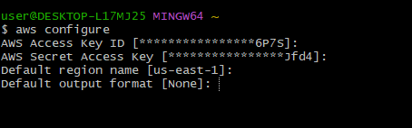

Alternatively, you can create the credentials file yourself. By default, its location is ~/.aws/credentials. At a minimum, the credentials file should specify the access key and secret access key. In this example, the key and secret key for the account are specified in the default profile:

```
aws_access_key_id = YOUR_ACCESS_KEY
aws_secret_access_key = YOUR_SECRET_KEY

```
 You may also want to add a default region to the AWS configuration file, which is located by default at ~/.aws/config:

```
region=us-east-1
```

Alternatively, you can pass a region_name when creating clients and resources.
##

## CREATING VPC AND SUBNETS

Let us create a directory structure

Open your Visual Studio Code and:

  - Create a folder called `PBL`
  - Create a file in the folder, name it `main.tf`

  - Add AWS as a provider, and a resource to create a VPC in the main.tf file.

  - Provider block informs Terraform that we intend to build infrastructure within AWS.

  - Resource block will create a VPC.

Note: You can change the configuration above to create your VPC in other region that is closer to you. The same applies to all configuration snippets that will follow.

```
provider "aws" {
  region = "us-east-1"
}

# Create VPC
resource "aws_vpc" "main" {
  cidr_block                     = "172.16.0.0/16"
  enable_dns_support             = "true"
  enable_dns_hostnames           = "true"
  enable_classiclink             = "false"
  enable_classiclink_dns_support = "false"
}

```


  - The next thing we need to do, is to download necessary plugins for Terraform to work. These plugins are used by providers and provisioners. At this stage, we only have provider in our main.tf file. So, Terraform will just download plugin for AWS provider.  Run `terraform init`


  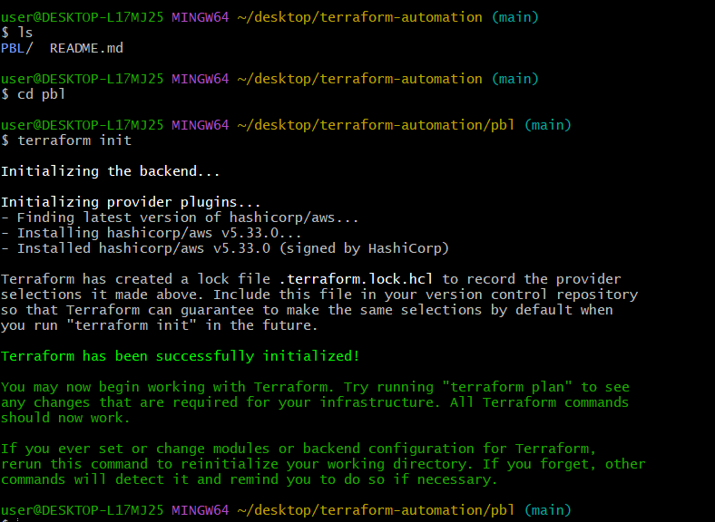

   - Notice that a new directory has been created: .terraform.... This is where Terraform keeps plugins. Generally, it is safe to delete this folder. It just means that you must execute terraform init again, to download them.

  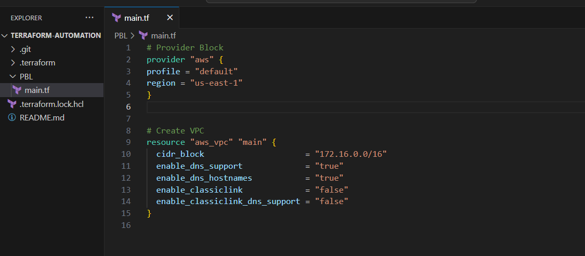

  -  we should check to see what terraform intends to create before we tell it to go ahead and create it. Run `terraform plan`


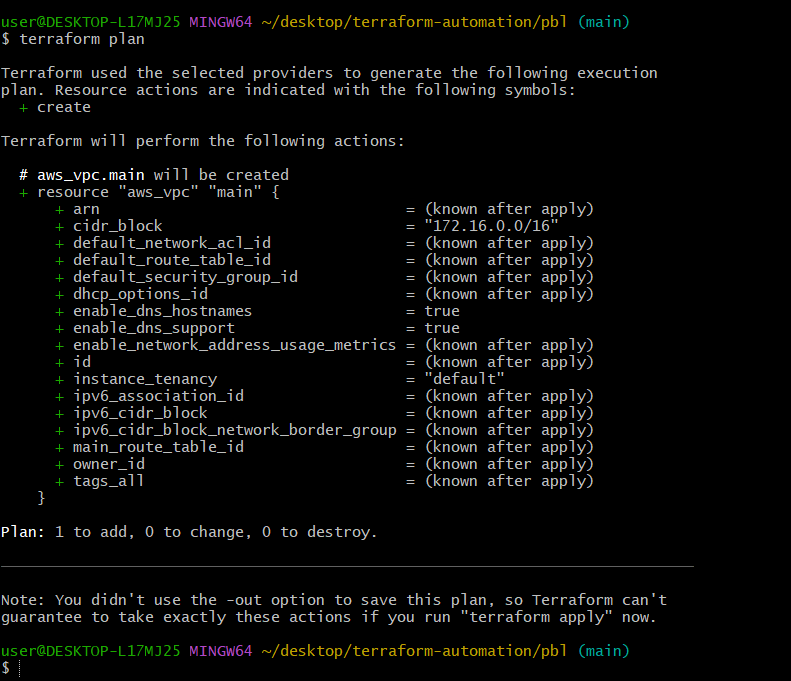

  - Then, if you are happy with changes planned, execute `terraform apply`


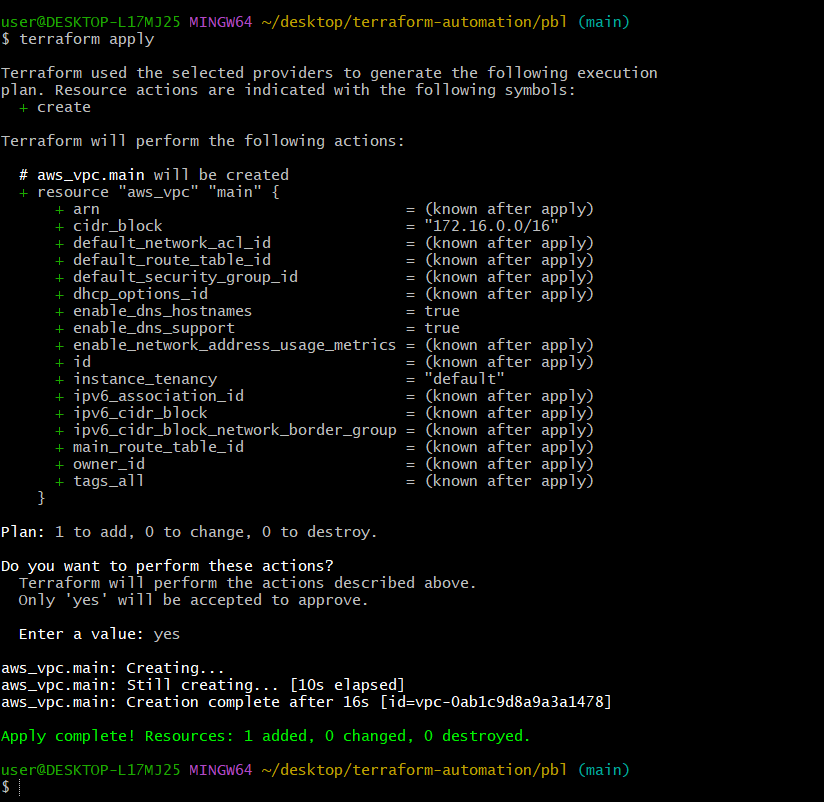

### CREATE PUBLIC SUBNETS

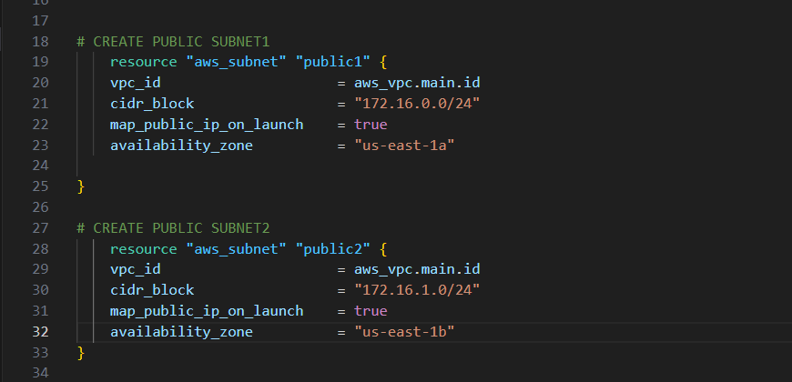

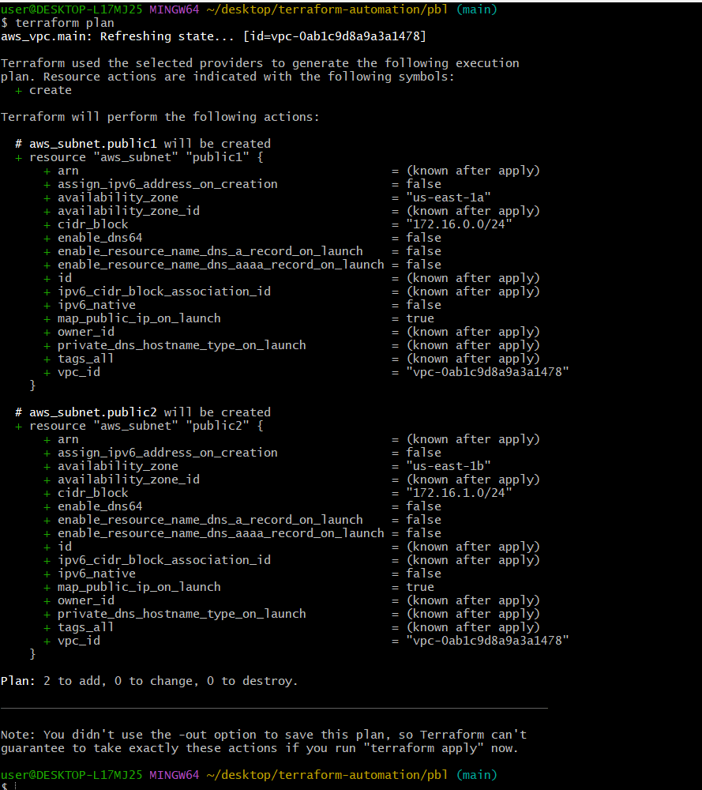

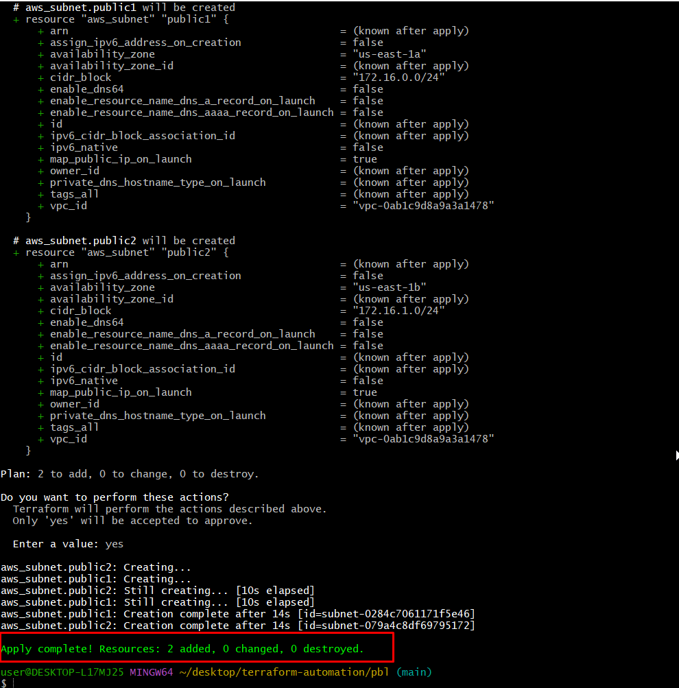

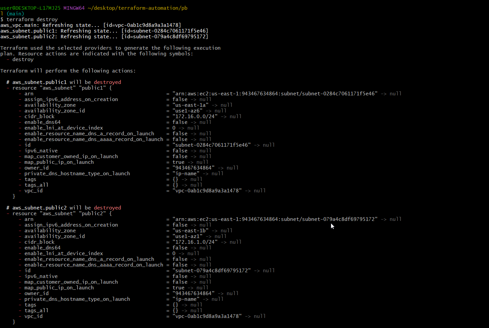

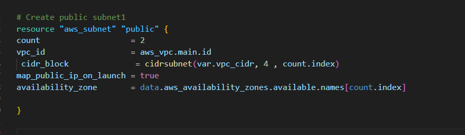

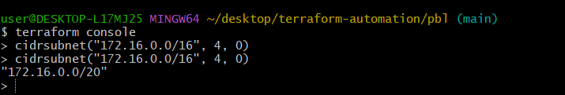

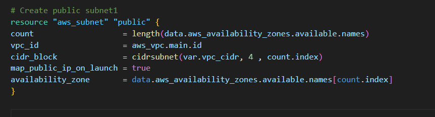

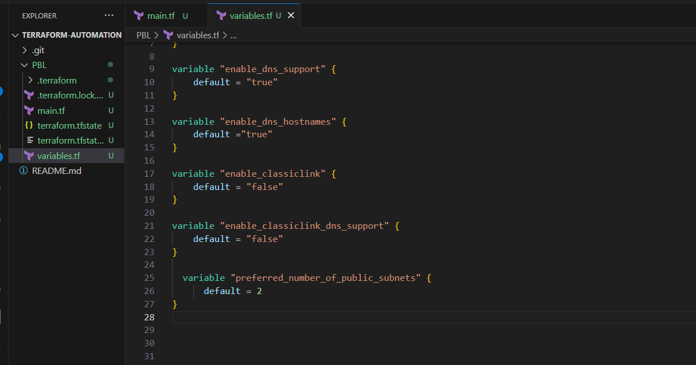

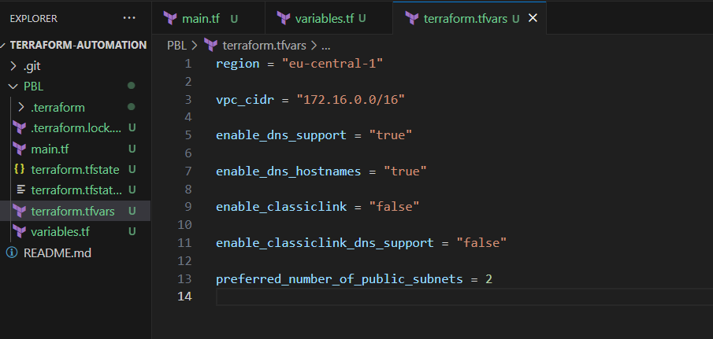

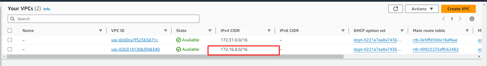

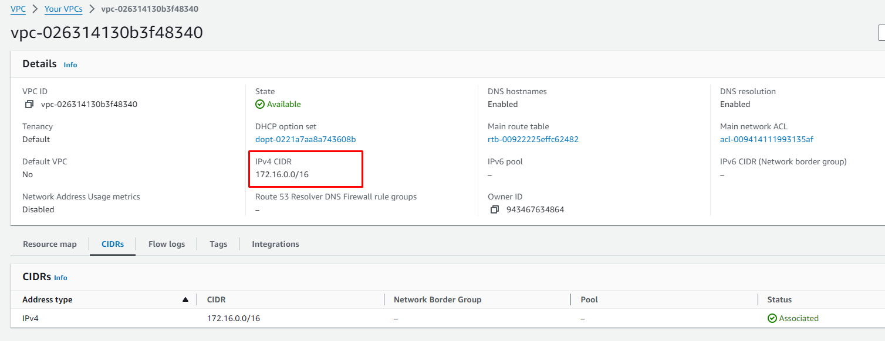

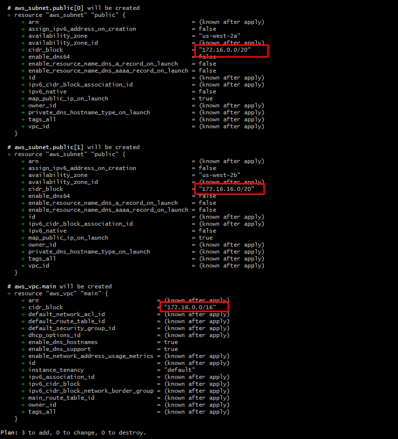

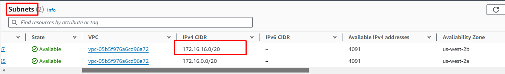

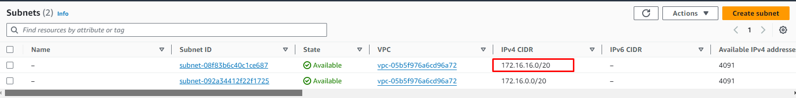

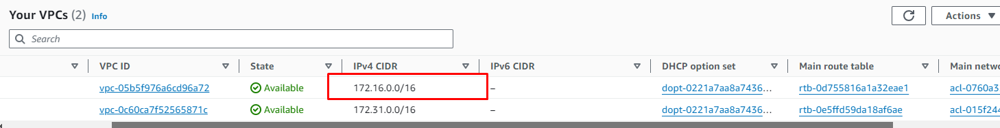

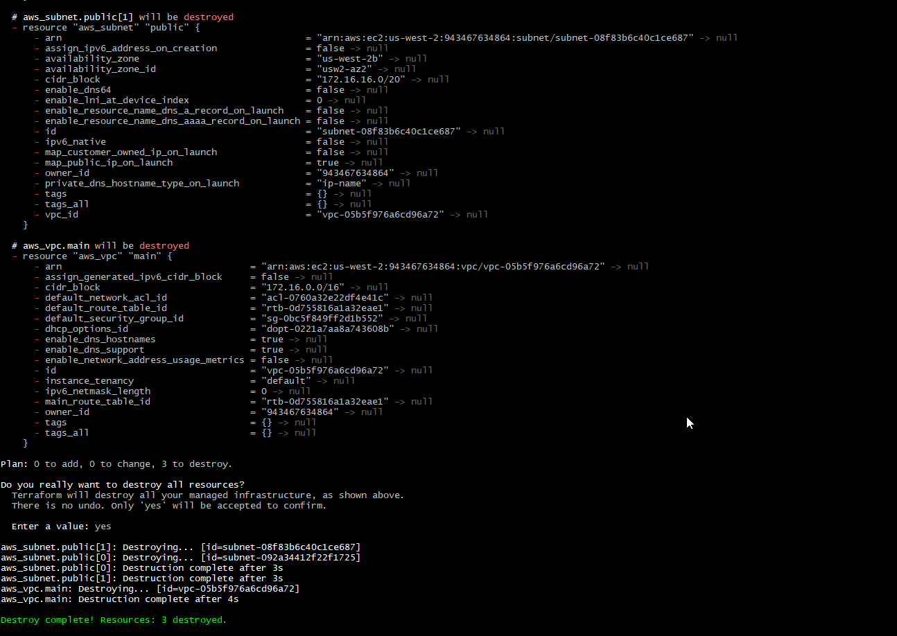


